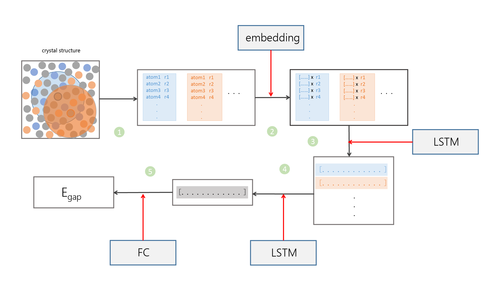

## 预测化合物性质的简单机器学习模型

一个用于预测周期性结构化合物带隙的机器学习模型，当然目的还是在于了解机器学习在化学研究中的应用，同时也加深自己对机器学习的理解

## 模型介绍

模型整体较为简单，从化合物结构开始到最后计算得到的输出值的过程中，数据流动处理的过程如图

    

数据将主要经过五个处理过程，其中后四个由神经网络完成。具体如下：

1. 由化合物的晶体结构得到原子列表

依据化合物的晶体结构可以得到晶体结构中的每一个原子、以及与其距离在截断距离之内的原子的种类和离中心原子的距离大小，将原子种类和离中心原子的距离信息编写成一个列表(在这个模型中，选取的是离原子最近的19个原子，组成共有20个原子的信息的列表)，晶体结构结构中原子的数量与列表的数量相同

2. 由原子列表得到表示原子的向量

使用词向量方法，将列表中不同种类的元素映射为特定长度的向量，并将该向量乘以元素对应的距离的倒数，将原子类别转换为向量。每一个列表转换成了一个元素为一定长度的向量的列表

3. LSTM对向量的列表处理

使用LSTM对向量列表进行处理，输出得到一定长度的一维向量。每一个向量列表被转换成一个一维向量。因此共有与晶体结构中原子的数量相同数量的一维向量，这些一维向量组成一个新的向量列表

4. LSTM对向量的列表处理

使用LSTM对新向量列表进行处理，输出得到一定长度的一维向量

5. 全连接层对一维向量的处理

使用全连接层对一维向量进行处理，输出结果值

对于一个晶体结构而言，其性质由结构中的所有原子共同决定。但是将晶体中所有的原子直接输入到单个神经网络中，一次性得到结果的方法不太容易实现。考虑到结构的性质包含了结构中的原子的贡献，那么可以先计算得到每一个原子的贡献，然后将所有原子的贡献“整合”，得到想计算的性质。其中计算单个原子的贡献和“整合”所有原子贡献的过程就由神经网络完成。

在结构中，一个原子会受到周围原子的影响，导致其贡献的改变。在上面介绍的模型中，第一步便是获得每一个原子其周围原子的信息。原子本身的性质则由一个可变的词向量表示，将表示原子性质的词向量乘以原子将距离的倒数，以简单考虑原子之间距离对其相互作用之间的影响。第三步中，使用lstm对原子与其周围的原子之间的相互作用进行计算，获得单个原子的贡献。接下来使用lstm+全连接网络“整合”了各个原子的贡献，最后得到了结构的性质结果。

在上面模型中实际只是计算了一定距离内的原子对中心原子的作用，因此本质上这个模型仍旧可以看作是建立在原子之间的局域相互作用之上的

## 数据集

### aflow数据

使用github用户rosenbrockc编写的aflow工具[1]，从aflow数据库[2]中下载得到晶体结构与对应的带隙的大小数据(带隙由DFT方法计算得到)。在下载数据中，添加了结构密度大于0.5g/cm3，计算使用PBE泛函，结构属于ICSD数据库等限定条件，以去除一些不合理的数据，最终获得60052个结构及其对应的带隙大小的数据

在模型的第一步中，设定了可处理1-85号元素的限制，最后获得28611个带隙不为零的结构数据，使用了其中的28600个数据(训练集25725个数据，测试集2875个数据)

### 其它数据集

对于周期性晶体结构而言，除开aflow数据库外，shyue ping ong课题组在文章中提供了materials projects数据库中的数据[3]，oqmd数据库[4]中也有较多的数据。

对于分子结构，qm9[5]，qm8[5]数据集中数据很多

## 结果

使用aflow数据对模型训练的得到的结果如下

    

其它已发表的机器学习模型的结果对比如下

|  model            |         mae(eV)|
| ------            | ------         | 
|   MEGNet[6]          |        0.32   |
|   CGCNN[7]           |         0.388 |
|   PLMF[8]            |         0.35  |
|   this model      |               |

由表中数据可以看到，当前模型取得了与其它已发表的模型相似的准确度

### 与其它模型的对比与思考

MEGNet和CGCNN中，研究者均将化合物结构的原子作为节点，将原子之间的键作为边，使化合物结构抽象为一个无向图，并使用了graph network[9]网络模型对该图进行处理，获得包含原子间作用的新图。然后对新图中的节点和边进行池化，接着使用全连接层得到最后的结果。两个模型中具体的处理方法不同，但主要的结构是相似的。

在抽象化合物结构为图的过程中，原子之间的键的确定仍旧使用原子之间的距离进行判断，因此方法与前面介绍的模型一致。graphnet网络模型中使用定义的方法对表示结构的图进行处理后，新图中不仅包含了原子之间的相互作用，也包含了原子之间的键信息，同时还有结构的晶格结构信息(对于周期性结构)。而在当前模型中，似乎只是考虑了原子之间的相互影响，对应着处理后的新图中的节点部分，也可能在模型的第一步和第二步的处理过程中已经隐式考虑了键与晶格的影响。从前面的模型的对比，可以看到magnet和CGCNN与当前模型之间的差别与联系。

在SchNet[10]和DTNN[11]模型中，原子之间的相互作用的处理更为复杂，较当前模型中仅使用的LSTM的方法细致很多。从schnet模型的结构来看，大致的框架仍与前面介绍的模型是相似的。由于schnet模型更加复杂，因此也具有更强的能力。

## 模型的推广

在模型的构建中，输入数据仅仅是化合物的结构，而不依赖于其它的变量。该模型能够用于训练以预测带隙的大小，那么同样能够被训练用于预测化合物结构的其它性质(对于晶体结构，如弹性模量，剪切模量，热容量，热导等；对于分子，如homo，lumo，零点能，偶极矩等)，因此是一个可推广而用于预测化合物其它诸多性质的通用模型

在将模型应用与其它化合物性质时，改变模型的结构可能可以获得更好的精度，同时超参数的的调整也对模型的表现具有重要的影响。因此这里其实主要提供的是一个建立预测化合物性质的机器模型的思路或者想法，而具体的应用则需要因地制宜

## 参考资料

[1] https://github.com/rosenbrockc/aflow

[2] www.aflowlib.org

[3] https://figshare.com/articles/Graphs_of_materials_project/7451351

[4] http://oqmd.org/

[5] http://quantum-machine.org/datasets/

[6] 《Graph Networks as a Universal Machine Learning
Framework for Molecules and Crystals》 https://arxiv.org/abs/1812.05055

[7] 《Crystal graph convolutional neural networks for an accurate
and interpretable prediction of material properties》  https://journals.aps.org/prl/abstract/10.1103/PhysRevLett.120.145301

[8] 《Universal fragment descriptors for predicting
properties of inorganic crystals》  https://www.nature.com/articles/ncomms15679/

[9] 《Relational inductive biases, deep learning, and graph networks》 https://arxiv.org/abs/1806.01261?context=cs

[10] 《SchNet-A deep learning architecture for molecules and materials》 https://aip.scitation.org/doi/10.1063/1.5019779 /  https://arxiv.org/abs/1712.06113

[11] 《Quantum-chemical insights from deep tensor neural networks》  https://www.nature.com/articles/ncomms13890